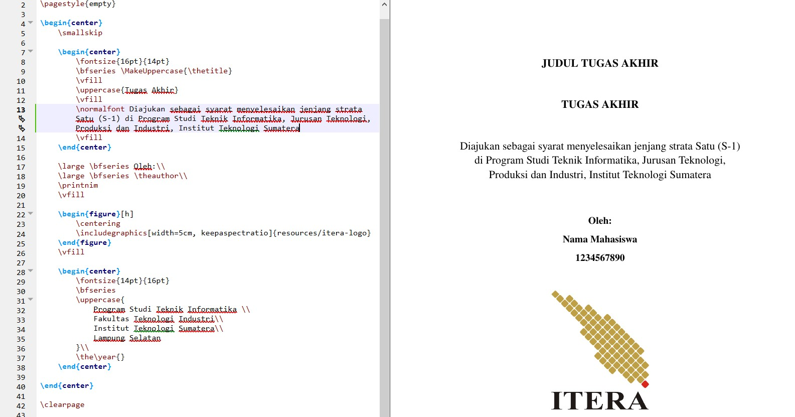

# Latex-TA-IF-ITERA
Template Latex Tugas Akhir untuk Program Studi Teknik Informatika, ITERA

Kontributor: Radhinka Bagaskara, Martin C.T. Manullang, I Wayan Wiprayoga Wisesa, Jose Alfredo Sitanggang (IF 2016), Ardoni Yeriko Rifana Gultom (IF 2021), Syabana Minggus Noviantosa (IF 2018), Rizki Alfaina (IF 2021)

## Apakah ini?

Proyek ini bertujuan untuk membuat template Tugas Akhir Teknik Informatika ITERA berbasis LaTex. Template dibuat berdasarkan template [Microsoft Word Tugas Akhir Informatika ITERA 1.3](https://docs.google.com/document/d/1SYtSpRevbRvscXIJRAxuT41kJqqzsHyw/edit?usp=sharing&ouid=103935211052656359121&rtpof=true&sd=true), serta berdasarkan [Templat LaTeX Tesis Informatika ITB](https://github.com/petrabarus/if-itb-latex) oleh Petra Barus & Peb Ruswono Aryan.

## Mengapa memakai LaTex?

Secara general, **LaTex akan menghasilkan dokumen yang lebih rapi & tingkat skalabilitas yang lebih tinggi dibandingkan dokumen Microsoft Word**. Walaupun begitu, penggunaan LaTex tidak selalu lebih mudah dibandingkan dengan Microsoft Word yang bersifat _what you see is what you get_ (WYSIWYG). Penjelasan sederhana LaTex dapat dilihat pada [slide berikut](https://docs.google.com/presentation/d/16ejeYsVfova5_QQAQxzL2NDmMPekJivV_LQMwEACFoI/edit?usp=sharing).

## Bagaimana cara menggunakannya?

Template dapat didownload dengan mengakses halaman [release](https://github.com/rdhnk/Latex-TA-IF-ITERA/releases). Atau dengan melakukan clone/download zip template. Bukalah file `thesis.tex` dengan menggunakan editor Latex.

## Editor LaTex seperti apa?

Template dapat dibuka & dicompile menggunakan editor seperti [TeXstudio](https://www.texstudio.org/) atau [Overleaf](https://www.overleaf.com). Template secara teknis diedit & diuji menggunakan TeXstudio.

## Mengapa ada dua jenis ukuran kertas dalam template ini?

Per Mei 2025, ITERA mengubah standar ukuran kertas Tugas Akhir dari A4 menjadi UNESCO (155 x 230 mm). Untuk ukuran A4, silakan gunakan folder [Template TA 2025 - Versi A4](Template%20TA%202025%20-%20Versi%20A4). **Template utama sudah disesuaikan dengan ukuran UNESCO. Kedepannya, template UNESCO adalah template yang akan diberi update & support.**
